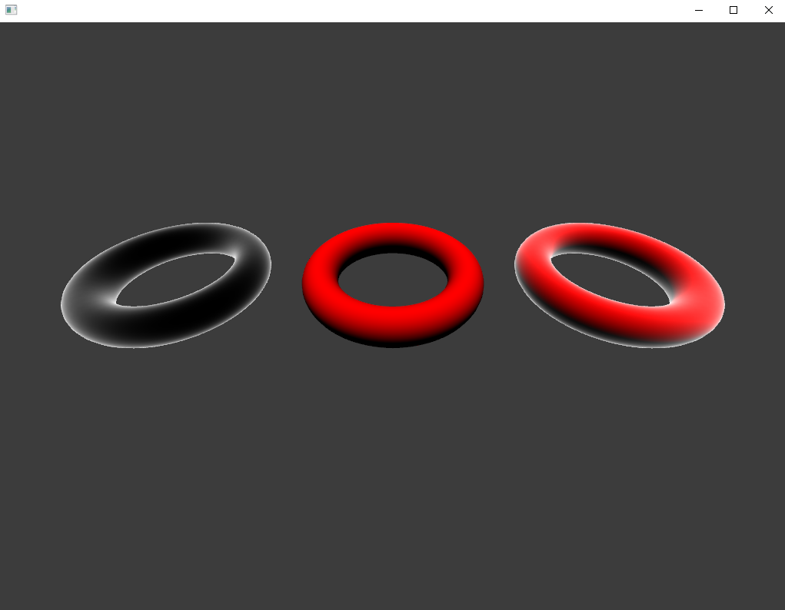

# 디퓨즈 라이팅

지금까지 사용한 메쉬는 각 버텍스에 위치, 색상, 텍스처 좌표 정보를 저장.

라이팅 계산은 `노말 벡터(normal vector)`라는 새로운 버텍스 속성에 의존함.

`노말 벡터(normal vector)`: 메쉬 표면과 직각으로 교차하면서 메쉬 밖을 향하는 벡터

</br>

mesh.vert

```glsl
#version 410

layout (location = 0) in vec3 pos; // location은 오픈프레임워크에서 정한 순서로 0번째는 위치
layout (location = 2) in vec3 nrm; // 2번쨰는 노말벡터, 3번째는uv(텍스처 좌표)

uniform mat4 mvp;

out vec3 fragNrm;

void main() {
  gl_Position = mvp * vec4(pos, 1.0);
  fragNrm = nrm;
}
```

normal_vis.frag
```glsl
#version 410

uniform vec3 lightDir;
uniform vec3 lightCol;

in vec3 fragNrm;

out vec4 outCol;

void main() {
  vec3 normal = normalize(fragNrm); // normalize - 정규화 함수
  outCol = vec4(fragNrm, 1.0);
}
```

대부분의 노말 벡터 연산은 벡터가 정규화된 상태임을 전제로 한다.

프래그먼트 셰이더에서 오는 사이에 보간된 벡터는 다시 정규화해주어야 한다(문제가 발생할 경우가 있음)

</br>

## 부드러운 셰이딩, 딱딱한 셰이딩

위처럼 보간되면 도넛같은 mesh에는 어울리지만 딱딱한 물체에는 부자연스러운 결과가 나옴

그럴때는 면의 정점들의 노말벡터 방향을 면이 향하는 방향으로 해주어야함.

설명이 어려워서 p.187 ~ 188 그림들을 보자.

</br>

## 월드 노말벡터와 섞기

현재 작성 기준으로 프래그먼트의 노말 벡터가 오브젝트 공간에 있는데 월드 공간의 노말벡터가 필요함

이렇게 하는게 씬에있는(월드) 라이트의 위치 정보를 다룰 때 좋다고 한다.

mesh.vert

```glsl
uniform mat4 model;

void main() {
  gl_Position = mvp * vec4(pos, 1.0);
  fragNrm = (model * vec4(nrm, 0.0)).xyz; // .xyz는 변환행렬은 vec4형인데 fragNrm는 vec3형이다 .xyz는 w를 제외하고 돌려줌
}
```

## 노말 행렬

메쉬 크기를 바꿀때 각 축에서 동일하게 크기를 조절하면 문제없지만 그렇지 않으면(x축은 짧게 y축은 길게 하는 등..) 노말벡터의 방향이 비정상이 될 수도 있음.

그래서 `모델 행렬`보다는 이를 기반으로 만든 `노말 행렬(normal matrix)`을 사용해 변환한다.

```glsl
mat3 normalMatrix = transpose(inverse(mat3(model)));
```

4x4에서 3x3행렬로 변경한다는 것은 회전, 크기를 정보를 유지하고 이동 정보를 제거한것.

mesh.vert

```glsl
uniform mat4 normal;

void main() {
  gl_Position = mvp * vec4(pos, 1.0);
  fragNrm = (normal * nrm).xyz; // .xyz는 변환행렬은 vec4형인데 fragNrm는 vec3형이다 .xyz는 w를 제외하고 돌려줌
}
```

## 라이팅 계산과 노말

`노말은 라이팅 계산에서 핵심적인 요소` 메쉬 표면에 도달하는 라이트의 방향과 그 표면의 방향 간의 관계를 파악하기 위해 필요함.

노말 벡터와 라이트간 각도가 180도에 가까울수록 정점에 받는 라이트의 양이 증가한다.

이 각도는 `내적(Dot Product)`을 통해 구한다.

간단)

* 내적값이 0 - 두 벡터가 직각으로 교차

* 0보다 큼 - 90도보다 작다

* 0보다 작음 - 90도보다 크다.

* 두 벡터의 크기를 곱한값(length(V0) * length(V1))을 내적(dot(v0, v1))으로 나누면 벡터간 코사인값을 얻을 수 있음.

## 디퓨즈 라이트(Diffuse lighrt)

디퓨즈(diffuse)또는 램버트(Lambertian) 라이팅이라 불리는 무광 라이팅.

빛을 반사하는 대신 빛이 모든 방향으로 흩어진다. 이러면 광택이 없다.

</br>

diffuse.frag
```glsl
#version 410

uniform vec3 lightDir;
uniform vec3 lightCol;
uniform vec3 meshCol;

in vec3 fragNrm;
out vec4 outCol;

void main() {
  vec3 normal = normalize(fragNrm);
  float lightAmt = max(0.0, dot(normal, lightDir)); 
  // 노말 벡터와 빛의 방향과의 내적(빛을 얼마나 받을지 구함)
  // max는 내적이 음수로 나오면 그 부분은 검정색으로 나오므로
  vec3 fragLight = lightCol * lightAmt; // 라이트 색상과 내적을 곱함으로 한 정점이 빛을 얼마나 받는지 설정할 수 있다.

  outCol = vec4(meshCol * fragLight, 1.0);
}
```

위에 작성된 셰이더의 계산은 실제와 반대로 이뤄지는데 노말 벡터가 메쉬 표면에서 밖을 향하는데 라이트 벡터는 메쉬표면을 향한다. 

이러면 빛이 다가올수록 어두워진다. 책에서는 이를 C++에서 라이트 방향을 반대로 저장하는 것으로 해결했다.

(셰이더에서 라이트 벡터를 반전하지 않고 의도대로 작동 할 수 있다한다.)

## 디렉셔널 라이트(Directional lighrt)

태양처럼 멀리서 하나의 방향으로 빛을 보내는 광원.

씬에 있는 모든 오브젝트는 동일한 방향의 동일한 양의 빛을 받는다.

</br>

app.cpp
```cpp
struct DirectionalLight {
  glm::vec3 direction;
  glm::vec3 color;
  float intensity;
};
```
게임에서는 최적화를 고려해 라이트 데이터를 파이프라인으로 보내기 전 라이트 색상을 강도로 곱하는것이 일반적이라고함.

프래그먼트에서 계산을 반복하기 보다 보내기 전 한번만 계산하는것이 효율적이므로.

app.cpp
```cpp
vec3 ofApp::getLightDirection(DirectionalLight& l) {
	return glm::normalize(l.direction * -1.0f);
}

vec3 ofApp::getLightColor(DirectionalLight& l) {
	return l.color * l.intensity;
}
```
라이트 만드는 함수

app.cpp
```cpp
void ofApp::draw() {

  cam.position = vec3(0, 0.75f, 1.0f);
  cam.fov = radians(90.0f);

  float cAngle = radians(-45.0f);
  vec3 right = vec3(1, 0, 0);
  mat4 view = inverse(translate(cam.position) * rotate(cAngle, right));
  mat4 model = rotate(radians(90.0f), right) * scale(vec3(0.5, 0.5, 0.5));
  mat3 normalMatrix = (transpose(inverse(mat3(model))));
  // 라이팅 효과를 제대로 확인하기 위해 mesh가 위를 향하게 카메라와 model을 설정

  DirectionalLight dirLight;

  dirLight.direction = normalize(vec3(0, -1, 0));
  dirLight.color = vec3(1, 1, 1);
  dirLight.intensity = 1.0f;
  // light 설정

  diffuseShader.begin();
  diffuseShader.setUniformMatrix4f("mvp", mvp);
  diffuseShader.setUniform3f("meshCol", glm::vec3(1, 0, 0));
  // 단색을 쓰면 라이트 색상이 메쉬 색상에 어떤 영향을 끼치는지 쉽게 확인할 수 있다한다.
  diffuseShader.setUniform3f("lightDir", getLightDirection(dirLight));
  diffuseShader.setUniform3f("lightCol", getLightColor(dirLight));
  diffuseShader.setUniformMatrix3f("normal", normalMatrix);
  torusMesh.draw();
  diffuseShader.end();
}
```

## 림 라이트(Rim light) 효과

라이트나 색상을 메쉬 형태의 외곽에 더해 보이지 않는 어떤 광원이 뒤에서 비추는 것과 같은 효과.

(google 검색해서 사진으로 보는게 이해하는데 빠름)

작동 방식은 디렉셔널 라이트와 매우 비슷하다.

라이트의 방향 벡터 대신 각 프래그먼트에서 카메라로 향하는 벡터를 계산에 사용한다.

rimlight.frag
```glsl
#version 410

uniform vec3 meshCol;
uniform vec3 cameraPos; // 월드 공간에서의 카메라 위치 필요

in vec3 fragNrm;
in vec3 fragWorldPos;
out vec4 outCol;

void main() {
  vec3 normal = normalize(fragNrm);
  vec3 toCam = normalize(cameraPos - fragWorldPos);

  float rimAmt = 1.0 - max(0.0, dot(normal, toCam)); // 프래그먼트에서 카메라로 향하는 벡터 계산
  // 1.0에서 뺴는 이유는 내적 값을 반전하기 위해(0과 1로 사이로 값을 제한함으로)
  // 반전하지 않으면 중심부가 밝아져서 림 라이트 효과가 아니게됨(외부가 밝아져야 림라이트)
  rimAmt = pow(rimAmt, 2); // 림 라이트가 집중하는 강도 조절(pow는 제곱함수)

  vec3 rimLightCol = vec3(1,1,1);
  outCol = vec4(rimLightCol * rimAmt, 1.0);
}
```

mesh.vert
```glsl
#version 410

layout (location = 0) in vec3 pos;
layout (location = 2) in vec3 nrm;

uniform mat4 mvp;
uniform mat3 normal;
uniform mat4 model;

out vec3 fragNrm;
out vec3 fragWorldPos;

void main() {
  gl_Position = mvp * vec4(pos, 1.0);
  fragNrm = (normal * nrm).xyz;
  fragWorldPos = (model * vec4(pos, 1.0)).xyz; // 버텍스 위치를 월드 공간으로 변환하기 위해 메쉬의 모델 행렬를 곱한다.
}

```



## 요약
`노말벡터` - 메쉬 표면에서 밖을 향하는 벡터(메쉬 표면의 형태 정보를 전달하기 위해 메쉬의 각 버텍스에 저장된다.)

`디퓨즈 라이팅` - 무광택 라이팅 유형(라이팅 양은 노말 벡터와 라이트의 방향 벡터를 내적해서 계산)

`림 라이트` - 뒤로부터 조명을 받는 듯한 셰이딩 기법(노말 벡터와 카메라로 향하는 벡터를 내적해서 계산)