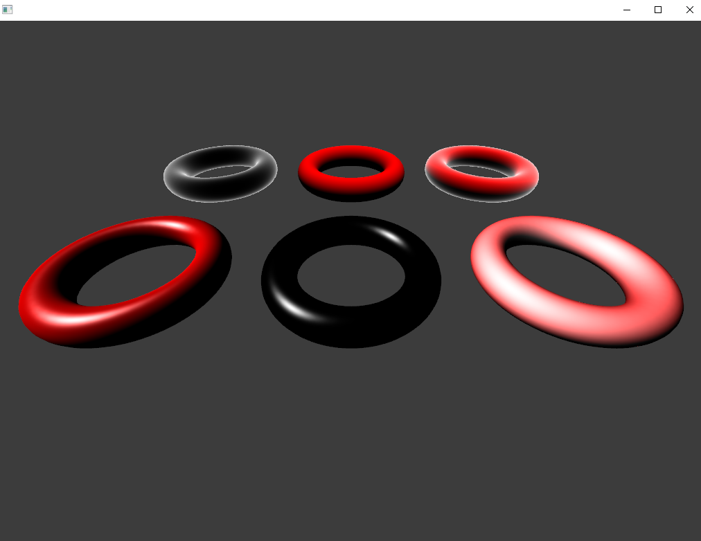

# 라이팅 모델

게임은 일반적으로 여러 종류의 라이팅 계산을 합쳐 모든 대상의 라이팅을 계산할 수 있는 하나의 공식을 만든다.

통합된 공식을 보통 `라이팅 모델(lighting model)`이라 한다.

</br>

## 스펙큘러 라이팅(Specular Lighting)
광택이 있는 라이팅

두 방향 벡터 간의 내적을 구하는 것이 핵심

</br>

[필요한 벡터]

1.광선이 프래그먼트로부터 튕겨 나오는 방향 벡터

2.프래그먼트의 위치로부터 카메라를 향하는 방향 벡터


광선이 프래그먼트로부터 튕겨 나오는 방향 벡터는 노말 벡터와 정규화된 라이트 방향 벡터로 구할 수 있다고 한다.

```glsl
vec3 refl = reflect(-lightDir, normalVec);
// 첫번째 인자는 들어오는 라이트 벡터, 두번째는 노말 벡터
// -lightDir는 reflect함수는 들어오는 라이트 벡터가 메쉬 표면을 향한다고 예상하기에 반전을 처리해줌
// C++상에서 코드 수정해도 되지만 이전 셰이더와의 호환성을 위해..
```

프래그먼트의 위치로부터 카메라를 향하는 방향 벡터
```glsl
vec3 toCam = normalize(camPos - fragWorldPos);
```
이 두 벡터를 내적하고 거듭제곱해서 강도를 제어한다.(이 거듭제곱 하는 지수를 `광택(shiness)`라고 지칭한다.)

</br>
specular.frag

```glsl
#version 410

uniform vec3 lightDir;
uniform vec3 lightCol;
uniform vec3 meshCol;
uniform vec3 meshSpecCol;
uniform vec3 cameraPos;

in vec3 fragNrm;
in vec3 fragWorldPos;
out vec4 outCol;

void main() {
  vec3 normal = normalize(fragNrm);
  vec3 refl = reflect(-lightDir, normal);
  vec3 viewDir = normalize(cameraPos - fragWorldPos);
  
  float specAmt = max(0.0, dot(refl, viewDir));
  float specBright = pow(specAmt, 16.0);

  outCol = vec4(meshCol * meshSpecCol * specBright, 1.0);
}
```

디퓨즈와 스펙큘러는 더하는 것으로 합칠 수 있다.
```glsl
vec3 diffCol = meshCol * lightCol * diffAmt;
vec3 specCol = meshSpecCol * lightCol * specBright;

outCol = vec4(diffCol + specCol, 1.0);
```

</br>

## 엠비언트 라이팅(Ambient Lightion)
빛은 물제에서 튕겨 나오는데 반사된 빛이 다른 물체를 비춘다 그래픽 에서는 이것을 `글로벌 조명(global illumination)`이라고 한다.

이 글로벌 조명을 가장 간단하게 재현하는 라이팅이 `엠비언트 라이팅`이다.

메쉬의 모든 프래그먼트에 색상을 더해주는 방식으로 작동한다.

색상을 담은 유니폼 변수를 만들고 `메쉬 색상과 곱한후 더해주면` 끝이다.
```glsl
uniform vec3 ambientColor;

vec3 ambient = ambientColor * meshColor;
outColor = vec4(diffCol + specCol + ambient, 1.0);
// 이 책 Color를 Col로 줄여서 가끔와서 보면 헷갈림
```

## 퐁 라이팅(Phong Lightion) 모델
앰비언트, 디퓨즈, 스펙큘러 라이팅의 조합으로 이루어진다.

이 세 라이팅은 프래그먼트가 각 라이팅의 영향을 얼마나 받을지 결정하는 상수에 의해 크기가 조정된다.

퐁 공식에서 라이트는 각 라이팅을 얼마나 비출 것인지 자신만의 상수를 갖는다.

자세한것은 퐁 라이팅 수학공식 검색

</br>

## 블린-퐁 라이팅(Blinn-Phong Lightion) 모델
퐁 셰이딩은 시야각에 따라 낮은 광택 값을 가진 오브젝트의 스펙큘러 라이팅에서 이상 현상이 발생하는 한계가 있다.

이는 반사되는 라이트 벡터와 카메라 벡터 간 각도가 90도를 초과하는 경우를 고려하지 않기 때문

그래서 `블린-퐁 라이팅`이라는 변형된 모델을 사용해 문제를 해결한다.

</br>

내용은 스펙큘러 라이팅에 사용되는 계산을 변형한것 기존의 퐁 보다 실제의 라이팅을 더 정확하게 재현한다고 한다.

블린-퐁은 스펙큘러에서 기존의 반사되는 라이트 벡터를 하프 벡터(half vector)라는 새로운 벡터로 대체한다.

```glsl
vec3 halfVec = normalize(viewDir + lightDir);
```

```glsl
// 기존
vec3 refl = reflect(-lightDir, normal);
float specAmt = max(0.0, dot(refl, viewDir));
float specBright = pow(specAmt, 16.0);

// 블린-퐁
vec3 halfVec = normalize(viewDir + lightDir);
float specAmt = max(0.0, dot(halfVec, normal));
float specBright = pow(specAmt, 64.0);
// 기존 퐁 모델보다 2~4배의 광택값을 사용해야 한다.

// 광선이 튕겨 나오는 방향을 노말 벡터와 정규화된 라이트 방향 벡터로 구하지 않고 뷰의방향과 빛의방향을 더한후 정규화하고 노말벡터와 내적하는 것으로 변경됨
```

